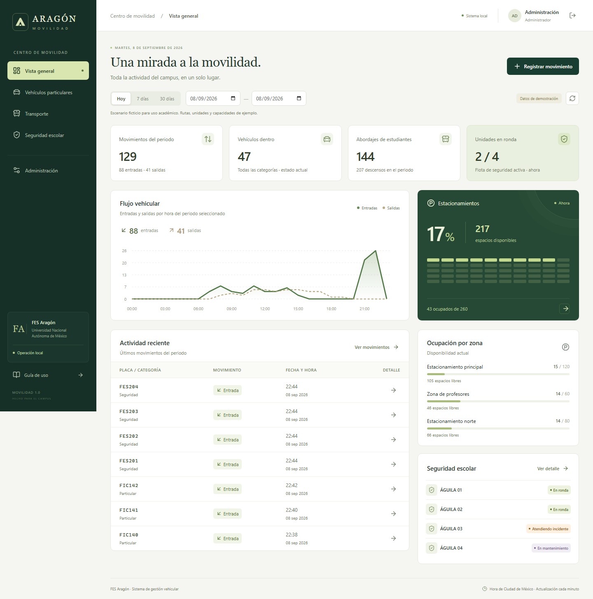

# Aragón Movilidad

Aplicación web local para gestionar accesos, estacionamientos, transporte y vehículos de seguridad de la FES Aragón. Implementa los requisitos del documento **Especificacion_Requisitos_Sistema_Vehicular_FES_Aragon.docx**. La interfaz, los comentarios y la documentación están en español.

Proyecto académico independiente. Los datos de demostración, matrículas, rutas y capacidades son ficticios; no es un sistema oficial de la UNAM.



## INICIAR EN LINUX SI NO TIENES node.js 24
npm exec --yes --package=node@24 --package=pnpm@11.24.0 -- pnpm dev

## Iniciar en Windows

1. Instala **Node.js 24 o superior** si todavía no lo tienes.
2. Haz doble clic en **[INICIAR.cmd](INICIAR.cmd)**. La primera ejecución descarga las dependencias y prepara la aplicación.
3. Cuando aparezca el mensaje de inicio, abre **http://localhost:3000**.

Mantén la ventana de la terminal abierta. Para detener la aplicación, presiona `Ctrl+C`. No necesitas Docker, una cuenta en la nube, un servidor de base de datos ni configurar claves.

La primera instalación requiere conexión a Internet. Después, la aplicación y sus recursos funcionan sin conexión.

## Iniciar desde una terminal

Desde la raíz de este repositorio, con Node.js 24+ y pnpm 11:

```powershell
pnpm install --frozen-lockfile
pnpm dev
```

Para ejecutar la versión compilada:

```powershell
pnpm build
pnpm start
```

Si no tienes pnpm, puedes usar `npx --yes pnpm@11.24.0` en lugar de `pnpm`. El lanzador de Windows lo hace automáticamente. `pnpm dev` sirve la interfaz y la API en un único puerto; no hace falta iniciar dos terminales.

## Cuentas de demostración

| Perfil                   | Usuario     | Contraseña    |
| ------------------------ | ----------- | ------------- |
| Administración           | `admin`     | `Aragon2026!` |
| Seguridad escolar        | `seguridad` | `Aragon2026!` |
| Dirección, solo consulta | `direccion` | `Aragon2026!` |

En la pantalla de inicio puedes pulsar un perfil para completar las credenciales. Las contraseñas se almacenan mediante **scrypt con sal aleatoria**, nunca en texto plano. Estas credenciales públicas están destinadas a la demostración local.

## Qué incluye

- **Vista general:** entradas, salidas, vehículos dentro, abordajes y descensos, flota en ronda, flujo por hora, disponibilidad por estacionamiento y actividad reciente.
- **Particulares:** registro de entrada/salida, filtros de placa, fecha, horario, movimiento y estacionamiento, detalle, historial por placa y lista de vehículos actualmente dentro.
- **Transporte:** catálogo de unidades y rutas, llegadas/salidas, abordajes y descensos enteros, totales del periodo y detalle de movimientos.
- **Seguridad:** cuatro estados operativos, observaciones, responsable, historial de estados y registro de accesos.
- **Administración:** altas y modificaciones de estacionamientos, unidades y usuarios; desactivación sin perder históricos; bitácora de acciones sensibles.
- **Reportes CSV:** exportación de los movimientos filtrados, del historial de seguridad y de la bitácora. UTF-8 compatible con Excel y neutralización de fórmulas en celdas.
- **Usabilidad:** diseño adaptable, formularios con validación, mensajes de confirmación, navegación por teclado, guía integrada y actualización cada minuto.

## Reglas de operación

La entrada de un vehículo abre una estancia y su salida la cierra. El servidor bloquea placas duplicadas dentro, salidas sin entrada, exceso de aforo, cambios cronológicamente inconsistentes y movimientos futuros. La placa se normaliza: `abc-123` y `ABC123` representan el mismo vehículo.

Solo los particulares ocupan plazas de estacionamiento. Transporte y seguridad se vinculan a unidades del catálogo. La salida conserva la unidad y el estacionamiento de su entrada; no depende de valores reenviados por el navegador.

Los indicadores del periodo se filtran por fecha del campus. **La ocupación, los vehículos presentes y los estados de seguridad siempre son actuales**, aunque se consulte una fecha histórica. La pestaña “Actualmente dentro” solo filtra por placa y estacionamiento. Los conteos de transporte representan eventos de abordaje y descenso, no personas únicas.

La fecha y hora del movimiento pueden capturarse manualmente; se guarda además la fecha real de captura. Los cambios de estado y la bitácora usan la hora del servidor. Las horas de la interfaz corresponden a `America/Mexico_City` y los instantes se almacenan en UTC. El alcance de las fechas operativas está pensado para el campus en el régimen actual UTC−06:00, no para reconstruir cambios históricos de horario de verano.

## Guardado y respaldo

La base se crea automáticamente en **`data/aragon.sqlite`**, junto con los archivos auxiliares de SQLite. Cerrar el navegador, cerrar sesión o reiniciar el equipo no elimina los registros. No borres esta carpeta si deseas conservar la información.

```powershell
pnpm backup
```

El respaldo se guarda en `backups/` con fecha y hora. Utiliza la API de respaldo de SQLite y puede ejecutarse con el servidor encendido. Para abrir un respaldo sin sobrescribir la base actual, detén el servidor y arranca apuntando al archivo:

```powershell
$env:DB_PATH = 'backups/aragon-FECHA.sqlite'
pnpm start
```

No copies solo el archivo principal mientras se está escribiendo: SQLite utiliza WAL. El comando de respaldo incluye una instantánea consistente. Los respaldos incluyen las cuentas y deben guardarse con el mismo cuidado que la base original. Si la carpeta está en OneDrive, evita ejecutar la misma base simultáneamente desde dos equipos; puedes definir `DB_PATH` fuera de la carpeta sincronizada.

## Iniciar una base vacía

La demostración se carga **una sola vez**, al crear la base. Para comenzar sin registros ficticios, utiliza un archivo nuevo y define la contraseña inicial:

```powershell
$env:DEMO_DATA = 'false'
$env:DB_PATH = 'data/aragon-limpio.sqlite'
$env:ADMIN_PASSWORD = 'EligeUnaClavePropiaDe8CaracteresOMas'
pnpm dev
```

Se creará únicamente el usuario `admin`. Inicia sesión y agrega estacionamientos, unidades y usuarios en Administración. Si la base ya contiene usuarios, estas variables no modifican ni reinician su información. Cambiar `ADMIN_PASSWORD` después del primer inicio tampoco cambia una contraseña existente; utiliza Administración.

| Variable opcional | Valor predeterminado                          | Uso                                                        |
| ----------------- | --------------------------------------------- | ---------------------------------------------------------- |
| `PORT`            | `3000`                                        | Puerto local                                               |
| `DB_PATH`         | `data/aragon.sqlite`                          | Archivo SQLite                                             |
| `DEMO_DATA`       | `true`                                        | Cargar demostración al crear una base                      |
| `ADMIN_PASSWORD`  | Contraseña de demostración, solo en modo demo | Contraseña inicial del administrador; obligatoria sin demo |

Se usan variables del proceso. No se carga automáticamente un archivo `.env`. El servidor escucha únicamente en `127.0.0.1`.

## Verificación

```powershell
pnpm lint
pnpm typecheck
pnpm test
pnpm build
pnpm exec playwright install chromium
pnpm test:e2e
```

Las pruebas de lógica y API cubren reglas de negocio, fechas, roles, hashes, reportes, entradas simultáneas, sesiones y persistencia. Las pruebas de navegador cubren entrada/salida, detalle, exportación, transporte, estados, catálogos, usuarios, consulta de directivos y adaptación móvil. Usan bases aisladas en la carpeta temporal y no modifican `data/aragon.sqlite`.

La compilación debe existir antes de `pnpm test:e2e`: el navegador verifica la versión compilada que sirve `pnpm start`. El puerto `3107` debe estar libre.

## Documentación del proyecto

- [Manual y guion de exposición](docs/MANUAL.md).
- [Arquitectura y modelo de datos](docs/ARQUITECTURA.md).
- [Matriz de requisitos y aceptación](docs/REQUISITOS.md).
- [Evidencia de validación](docs/VALIDACION.md).

Tecnologías: React, TypeScript estricto, Vite, Express, Zod y SQLite nativo de Node.js. El uso de SQLite evita instalar un servicio adicional; consulta la [documentación de Node.js](https://nodejs.org/api/sqlite.html). La configuración de compilación sigue el modelo de [Vite](https://vite.dev/guide/). pnpm autoriza únicamente el script de construcción de esbuild mediante [`allowBuilds`](https://github.com/pnpm/pnpm.io/blob/main/blog/releases/11.0.md).

## Límites del alcance

El proyecto está preparado para demostración y operación local de pequeña escala. No incluye cámaras/LPR, GPS, plumas, aplicaciones móviles nativas ni conexiones a sistemas reales de la UNAM. No hay envío de mensajes, recuperación de contraseña por correo ni servicios externos. El administrador puede restablecer contraseñas desde el catálogo de usuarios.

Los movimientos se conservan sin edición ni eliminación; el documento permite excepciones por corrección autorizada pero no exige un flujo de corrección. Esta versión aplica la regla estricta y registra una nueva entrada solo tras una salida válida. Las desactivaciones de catálogos conservan las referencias históricas; cambiar un nombre de catálogo se refleja en las consultas vinculadas, mientras la bitácora conserva los cambios efectuados.

Las consultas filtran en el servidor y la tabla se pagina en el navegador. Para historiales muy grandes, el siguiente paso sería añadir paginación y agregación SQL. La consulta de demostración no constituye una prueba de carga de un campus real. No se ha realizado un despliegue público ni una auditoría de producción.
