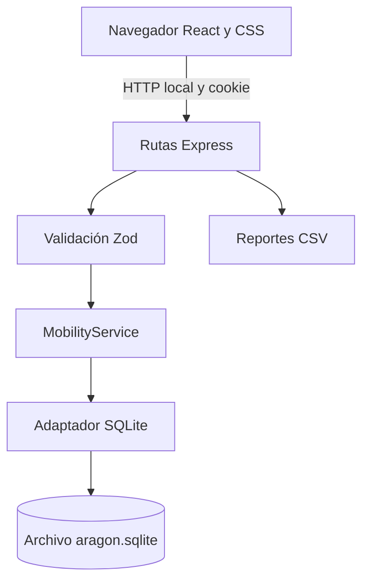
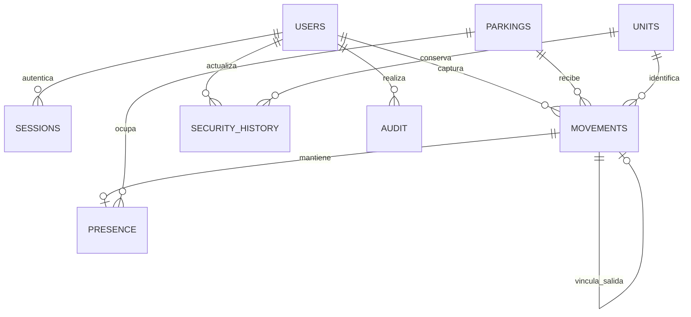

# Arquitectura del sistema

## Decisiones

Una sola aplicación Node.js sirve una interfaz React y una API Express. SQLite almacena información en el equipo. Se eligió esta estructura para reducir la instalación a Node.js y dependencias del proyecto, con reglas reales del lado del servidor y persistencia duradera.

La interfaz y la API comparten tipos de TypeScript. Zod valida los datos antes de ejecutar los casos de uso. React no accede directamente a SQLite y el navegador nunca recibe hashes de contraseñas ni tokens de sesión por JSON.

## Organización del código

| Ruta                   | Responsabilidad                                       |
| ---------------------- | ----------------------------------------------------- |
| `src/App.tsx`          | Sesión, navegación y coordinación de módulos          |
| `src/features/`        | Pantallas separadas por autenticación y dominio       |
| `src/layout/`          | Elementos persistentes de identidad y estructura      |
| `src/Dashboard.tsx`    | Indicadores, gráfica y ocupación                      |
| `src/components.tsx`   | Tablas, filtros, formularios base y diálogos          |
| `src/forms.tsx`        | Captura de movimientos, estados y catálogos           |
| `src/lib.ts`           | Cliente de API, consultas y fechas de presentación    |
| `src/styles.css`       | Identidad visual, diseño adaptable y accesibilidad    |
| `shared/types.ts`      | Contratos de datos y etiquetas de presentación        |
| `server/validation.ts` | Esquemas y validación de entradas                     |
| `server/service.ts`    | Fachada estable de los casos de uso                   |
| `server/services/`     | Permisos, movimientos y administración por dominio    |
| `server/database.ts`   | Esquema, transacciones, consultas y contraseñas       |
| `server/seed.ts`       | Inicialización y datos ficticios                      |
| `server/app.ts`        | API, autenticación, protección de solicitudes y CSV   |
| `server/index.ts`      | Inicio local, interfaz compilada o Vite en desarrollo |
| `scripts/backup.ts`    | Respaldo consistente de SQLite                        |
| `tests/`               | Pruebas de dominio, API y navegador  x                |

## Modelo de datos

- `users`: nombre mínimo, usuario único, hash, rol y estado activo.
- `sessions`: resumen SHA-256 del token aleatorio, usuario y vencimiento.
- `parkings`: nombre, capacidad y estado activo. La ocupación se deriva de `presence`.
- `units`: identificador, placa, categoría, ruta/zona, capacidad, estado activo y estado operativo vigente.
- `movements`: placa normalizada, entrada/salida, categoría, acceso, fecha del evento, fecha de captura, usuario, estacionamiento o unidad, conteos y observación. Una salida referencia su entrada mediante `entry_id` único.
- `presence`: una fila por placa dentro y referencia única a la entrada abierta. Evita duplicados de estancia.
- `security_history`: transición de estados, observación y usuario responsable. El estado inicial de las nuevas unidades también se conserva.
- `audit`: acción, entidad, identificador, detalle, usuario e instante. No incluye contraseñas.
- `metadata`: identifica si la base corresponde a una demostración.

El esquema inicial se crea de forma idempotente al arrancar y utiliza `PRAGMA user_version = 1`. No existen migraciones heredadas. Una futura modificación incompatible del esquema deberá incorporar una migración explícita antes de cambiar la versión.

## Transacciones e integridad

Cada registro de movimiento realiza `BEGIN IMMEDIATE`, comprueba la última actividad de la placa, valida presencia y aforo, inserta el evento, actualiza `presence` y agrega la bitácora. Todo se confirma junto o se revierte. SQLite serializa escritores; las restricciones de unicidad y claves foráneas complementan la validación del servicio.

El estado de seguridad y su historial se guardan en la misma transacción. Los catálogos y usuarios también se actualizan junto con su bitácora. Se prohíben desactivaciones que dejen unidades dentro o estacionamientos ocupados y se conserva al menos un administrador activo.

## Autenticación y permisos

Las contraseñas se procesan con scrypt, una sal aleatoria de 16 bytes y una clave derivada de 64 bytes. La comparación usa `timingSafeEqual`. El inicio de sesión devuelve una cookie HttpOnly y SameSite=Strict; el token tiene 32 bytes aleatorios y el servidor almacena solo su resumen. Las sesiones expiran a las ocho horas.

Cada petición autenticada consulta el usuario actual y comprueba que esté activo. Las acciones de escritura y administración verifican el rol en el servicio, aunque se invoque la API directamente. Cambiar contraseña, rol o activar la desactivación revoca las sesiones afectadas. La respuesta de usuario no contiene el hash.

Las escrituras requieren JSON, una cabecera propia y, si existe Origin, que coincida con el origen del servidor. No se habilita CORS. Quince intentos fallidos bloquean el inicio de sesión por dirección durante cinco minutos. Es una protección local básica, no un sistema distribuido de prevención de ataques.

## Fechas y consulta

Los eventos se normalizan a ISO 8601 UTC. La interfaz presenta horas de `America/Mexico_City`. Los filtros de día convierten los límites del campus UTC−06:00 a intervalos UTC semiabiertos. La fecha final incluye todo el día. El filtro horario usa el reloj del campus y es inclusivo; para un rango que cruce medianoche deben realizarse dos consultas o usar el rango de fechas.

La presencia se calcula a partir de todas las estancias abiertas. Las fechas del dashboard solo filtran movimientos, conteos y flujo horario. La gráfica agrupa por hora del día y, si se seleccionan varios días, suma cada franja horaria. No pretende reconstruir la ocupación histórica.

## API principal

| Método y ruta                                                       | Función                        | Permiso                   |
| ------------------------------------------------------------------- | ------------------------------ | ------------------------- |
| `POST /api/login`                                                   | Iniciar sesión                 | Público                   |
| `POST /api/logout`                                                  | Revocar sesión                 | Autenticado               |
| `GET /api/me`                                                       | Cuenta actual                  | Autenticado               |
| `GET /api/overview`                                                 | Dashboard, catálogos y usuario | Autenticado               |
| `GET /api/movements`                                                | Consulta filtrada              | Autenticado               |
| `GET /api/movements/:id`                                            | Detalle                        | Autenticado               |
| `POST /api/movements`                                               | Registrar entrada/salida       | Seguridad o administrador |
| `GET /api/presence`                                                 | Estancias abiertas             | Autenticado               |
| `PATCH /api/units/:id/status`                                       | Cambiar estado de seguridad    | Seguridad o administrador |
| `GET /api/security/history`                                         | Historial filtrado             | Autenticado               |
| `GET /api/users`                                                    | Listado de usuarios            | Administrador             |
| `POST /api/parkings`, `POST /api/units`, `POST /api/users`          | Alta en catálogos              | Administrador             |
| `PUT /api/parkings/:id`, `PUT /api/units/:id`, `PUT /api/users/:id` | Edición o desactivación        | Administrador             |
| `GET /api/audit`                                                    | Bitácora filtrada              | Administrador             |
| `GET /api/reports/movements.csv`                                    | Reporte de movimientos         | Autenticado               |
| `GET /api/reports/security.csv`                                     | Reporte de estados             | Autenticado               |
| `GET /api/reports/audit.csv`                                        | Reporte de bitácora            | Administrador             |

Filtros opcionales: `from`, `to`, `plate`, `category`, `type`, `parking`, `unit`, `timeFrom`, `timeTo`. `status` se utiliza en el historial de seguridad. La bitácora utiliza `from` y `to`. Se usan consultas parametrizadas y no se interpolan valores del usuario en SQL.

## Evolución razonable

Para un volumen mayor convendría paginar en SQL, agregar contadores en la base, implementar correcciones autorizadas con trazabilidad y versionar migraciones. Un uso institucional exigiría definir retención de datos, respaldo fuera del equipo, administración de secretos, despliegue HTTPS, recuperación de cuentas y pruebas con carga real. Esas capacidades no forman parte de esta entrega local.
